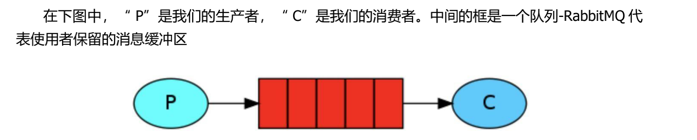
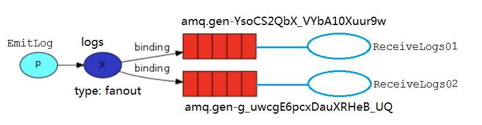
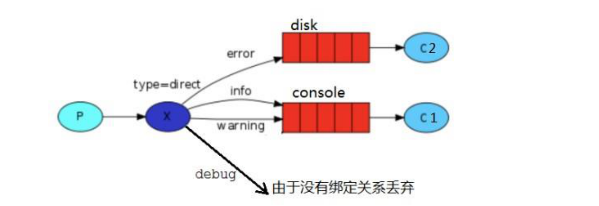
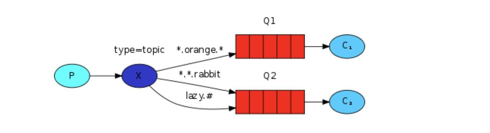
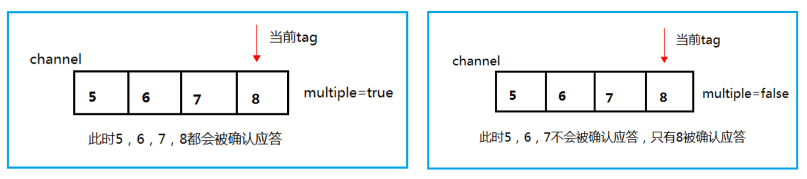
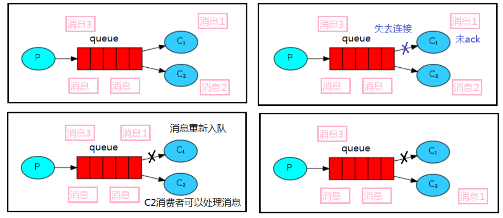

## 简单模式
RabbitMQ 中最简单的Hello World模式。也就是一个生产者、一个消费者、一个队列；生产者P发送消息到队列Q，一个消费者C接收消息。

## 工作模式
Work Queues 是工作队列模式，也就是一个生产者、多个消费者、一个队列。
它的主要思想是避免排队等待，避免一个消息处理时间过久而无法处理下一个的问题。因此相比简单模式可以有多个消费者，原理就是我们把任务封装为消息并将其发送到队列中，这多个消费者可以一起处理队列中的任务。

## Fanout模式
    Fanout 这种类型非常简单，它是将接收到的所有消息广播到它知道的所有队列中。RabbitMQ 系统中默认有一个 fanout 类型的交换机。

## Direct模式
Fanout 这种交换类型并不能给我们带来很大的灵活性，它只能进行无意识的广播，在这里我们将使用 direct 类型来替换，direct 类型的工作方式是：消息只去到它绑定的 routingKey 队列中去。

## Topics模式
发送到类型是 topic 交换机的消息的 routing_key 不能随意写，必须满足一定的要求，它必须是一个单词列表，以点号分隔开。这些单词可以是任意单词，比如说：“stock.usd.nyse”、“nyse.vmw”、“quick.orange.rabbit” 这种类型的。当然这个单词列表最多不能超过 255 个字节。
    星号*可以代替一个单词
    井号#可以替代零个或多个单词

# rabbitMQ机制
## 消息应答
默认情况下，RabbitMQ 一旦向消费者发送了一条消息后，便立即将该消息标记为删除。由于消费者处理一个消息可能需要一段时间，假如在处理消息中途消费者挂掉了，我们会丢失其正在处理的消息以及后续发送给该消费这的消息。 为了保证消息在发送过程中不丢失，RabbitMQ 引入消息应答机制，消息应答意思就是：消费者在接收消息并且处理完该消息之后，才告知 RabbitMQ 可以把该消息删除了。 RabbitMQ 中消息应答方式有两种：自动应答（默认）、手动应答 RabbitMQ 中消息应答通过以下方法来实现：
    
    // 肯定确认
    void basicAck(long deliveryTag, boolean multiple)

    // 否定确认
    void basicNack(long deliveryTag, boolean multiple, boolean requeue)
    void basicReject(long deliveryTag, boolean requeue)
其中：deliveryTag表示消息的标志，multiple表示是否为批量应答（ture 代表批量应答channel上未应答的消息，比如当前channel上有传送tag为5678的消息，如果应答时tag=8，则5～8的这些还未应答的消息都会被确认收到消息应答；如果为 false 则此时只会应答tag=8的消息，567的消息不会被应答）

自动应答
自动应答即消息发送后立即被认为已经传送成功，也就是RabbitMQ默认采用的消息应答方式。这种模式需要在高吞吐量和数据传输安全性方面做权衡，因为该模式下如果消息在被接收之前，消费者的 connection 或者 channel 关闭，消息就丢失了。此外，由于消费者没有对传递的消息数量进行限制，发送方可以传递过载的消息，可能会造成消费者这边由于接收太多消息来不及处理，导致这些消息的积压，使得内存耗尽，最终使得这些消费者线程被操作系统杀死。

所以这种模式仅适用在消费者可以高效并以某种速率能够处理这些消息的情况下使用。

手动应答
采用手动应答后的消息自动重新入队可以避免自动应答中消息丢失的情况。如果消费者由于某些原因失去连接(其通道已关闭，连接已关闭或 TCP 连接丢失)，导致消息未发送 ACK 确认，RabbitMQ 将了解到消息未完全处理，并将对其重新排队。如果此时其他消费者可以处理，它将很快将其重新分发给另一个消费者。这样，即使某个消费者偶尔死亡，也可以确保不会丢失任何消息。

## 消息持久化
前面我们通过手动应答处理了消息丢失的情况，但是如何保障当 RabbitMQ 服务停掉以后消息生产者发送过来的消息不丢失。默认情况下 RabbitMQ 退出或由于某种原因崩溃时，它会清空队列和消息，除非告知它不要这样做。确保消息不会丢失需要做两件事：我们需要将队列和消息都标记为持久化。
### 队列持久化
    channel.queueDeclare(QUEUE_NAME, true, false, false, null);//如果要队列实现持久化就需要在声明队列的时候把 durable 参数设置为 true
### 消息持久化
将消息标记为持久化并不能完全保证不会丢失消息。尽管它告诉 RabbitMQ 将消息保存到磁盘，但是这里依然存在当消息刚准备存储在磁盘的时候 但是还没有存储完，消息还在缓存的一个间隔点。此时并没有真正写入磁盘。持久性保证并不强，但是对于我们的简单任务队列而言，这已经绰绰有余了。如果需要更强有力的持久化策略。

    channel.basicPublish("logs", "", MessageProperties.PERSISTENT_TEXT_PLAIN, message.getBytes());//添加MessageProperties.PERSISTENT_TEXT_PLAIN 属性。
## 不公平分发
前面我们了解到 RabbitMQ 默认分发消息采用的轮训分发模式，但是在某种场景下这种策略并不是很好，比方说有两个消费者在处理任务，其中 consumer01 处理任务的速度非常快，而 consumer02 处理速度却很慢，此时如果我们还是采用轮训分发的化就会使处理速度快的 consumer01 很大一部分时间处于空闲状态，而 consumer02 一直在干活，这种分配方式在这种情况下其实就不太好，但是 RabbitMQ 并不知道这种情况它依然很公平的进行分发。

为了避免这种情况，我们可以设置参数 channel.basicQos(1)，意思就是每个消费者只能处理完当前消息才能接受新的消息。

    int prefetchCount = 1;
    channel.basicQos(prefetchCount);
## 预取值
本身消息的发送就是异步发送的，所以在任何时候，channel 上肯定不止只有一个消息另外来自消费者的手动确认本质上也是异步的。因此这里就存在一个未确认的消息缓冲区，因此希望开发人员能限制此缓冲区的大小，以避免缓冲区里面无限制的未确认消息问题。

这个时候就可以通过使用 basic.qos 方法设置“预取计数”值来完成。该值定义通道上允许的未确认消息的最大数量。一旦数量达到配置的数量，RabbitMQ 将停止在通道上传递更多消息，除非至少有一个未处理的消息被确认。假设在通道上有未确认的消息 5、6、7，8，并且通道的预取计数设置为 4，此时 RabbitMQ 将不会在该通道上再传递任何消息，除非至少有一个未应答的消息被 ack。比方说 tag=6 的消息刚刚被确认 ACK，RabbitMQ 将会感知这个情况到并再发送一条消息。

消息应答和 QoS 预取值对用户吞吐量有重大影响。通常增加预取将提高向消费者传递消息的速度，虽然自动应答传输消息速率是最佳的，但是在这种情况下已传递但尚未处理的消息的数量也会增加，从而增加了消费者的RAM消耗。我们应该小心使用具有无限预处理的自动确认模式或采用手动确认模式，消费者消费了大量的消息如果没有确认的话，会导致消费者连接节点的内存消耗变大，所以找到合适的预取值是一个反复试验的过程，不同的负载该值取值也不同 100 到 300 范围内的值通常可提供最佳的吞吐量，并且不会给消费者带来太大的风险。预取值为 1 是最保守的。当然这将使吞吐量变得很低，特别是消费者连接延迟很严重的情况下，特别是在消费者连接等待时间较长的环境中。对于大多数应用来说，稍微高一点的值将是最佳的。

## 发布确认
    发布确认默认是没有开启的，如果要开启需要调用方法 confirmSelect，每当你要想使用发布确认，都需要在 channel 上调用该方法
    // 开启发布确认
    channel.confirmSelect();
发布确认机制有三种策略：单个确认发布、批量确认发布、异步确认发布。其中前两者是同步确认的方式，也就是发布一个/一批消息之后只有被确认发布，后续的消息才能继续发布，后者是异步确认的方式，我们只管发布消息即可，消息是否被确认可以通过回调函数来接收到。
